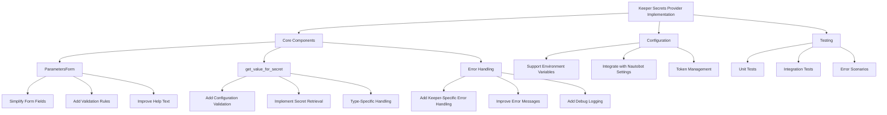

# Keeper Secrets Provider Implementation Plan

## Overview
This plan outlines the improvements necessary for the Keeper Secrets Provider in Nautobot.

## Diagram

## Key Improvements

### ParametersForm
- Require either "name" or "uid" (but not both).
- Make "token" optional if "config" is available.
- Add proper validations and improve help text.

### get_value_for_secret
- Implement robust configuration validation.
- Implement type-specific secret retrieval.
- Provide clear error handling and error messages.

### Error Handling
- Use Keeper-specific error messages.
- Add debug logging where necessary.

### Configuration
- Support environment variables.
- Integrate with Nautobot settings.
- Manage token configuration and potential refresh/rotation.

### Testing
- Develop unit tests.
- Integrate tests to cover error scenarios.
- Verify integration with Keeper Secrets Manager API.